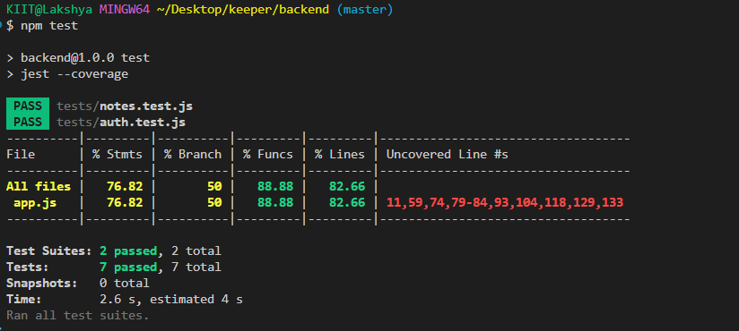

# 📝 KeepDesk - Notes Management Web Application

KeepDesk is a full-stack web application designed to help users manage personal notes with features like user registration, authentication, and full CRUD operations for notes. It includes a React-based frontend, Node.js + Express backend, and MongoDB for data storage.

---

## ⚙️ Features

- User registration and secure login with hashed passwords
- JWT-based authentication for secure API access
- Create, read, update, and delete notes
- User-specific data storage using MongoDB
- React frontend for seamless user experience
- Docker support for easy deployment

---

## 🛠️ Tech Stack

| Layer     | Technology          |
|-----------|---------------------|
| Frontend  | React.js            |
| Backend   | Node.js, Express.js |
| Database  | MongoDB / MongoDB Atlas |
| Auth      | JWT, bcrypt         |
| Tools     | Docker, dotenv, cors |

---

## 🚀 Getting Started

### 📁 Clone the Repository

```bash
git clone https://github.com/dhingralakshya/KeepDesk.git
cd KeepDesk
```

### Environment Variable configuration

Add the following envs:

```
port=4000
JWT_SECRET=your_jwt_secret
server=mongodb://localhost:27017/keepdesk
```

For MongoDB Atlas (cloud), use:
```
server=mongodb+srv://<username>:<password>@cluster.mongodb.net/keepdesk?retryWrites=true&w=majority
```

### How to Run the Server
#### Option 1: Using Docker (Recommended)
1. Clone the repository
```bash
git clone https://github.com/dhingralakshya/KeepDesk.git
cd KeepDesk
```
2. Run with Docker Compose
```bash
docker-compose up --build
```

#### Option 2: Manual Setup
1. Clone and setup backend
```bash
git clone https://github.com/dhingralakshya/KeepDesk.git
cd KeepDesk/backend
npm install
```

2. Start backend server using
```bash
node server.js
```

3. Setup frontend (in a new terminal)
```bash
cd KeepDesk
npm install
```

4. Start the frontend
```bash
npm start
```

## API Documentation
All APIs are protected (except register and login). Use a valid JWT in the Authorization header:
```
Authorization: Bearer <your_token>
```

| Method | Endpoint        | Description                             | Auth Required |
|--------|------------------|-----------------------------------------|----------------|
| POST   | `/register`      | Register a new user                     | ❌ No          |
| POST   | `/login`         | Login and get JWT token                 | ❌ No          |
| GET    | `/`              | Get all notes of the logged-in user     | ✅ Yes         |
| POST   | `/`              | Create a new note                       | ✅ Yes         |
| PATCH  | `/update/:id`    | Update a specific note by ID            | ✅ Yes         |
| POST   | `/delete`        | Delete a specific note (pass ID in body)| ✅ Yes         |


## Testing & Coverage
How to Run Tests
```bash
npm test
```
- Uses Jest, Supertest, and mongodb-memory-server.
- Covers unit, integration, and API tests.

| Metric     | Coverage   |
|------------|------------|
| Statements | 76.82%     |
| Branches   | 50.00%     |
| Functions  | 88.88%     |
| Lines      | 82.66%     |

✅ Goal of 70%+ coverage achieved!

